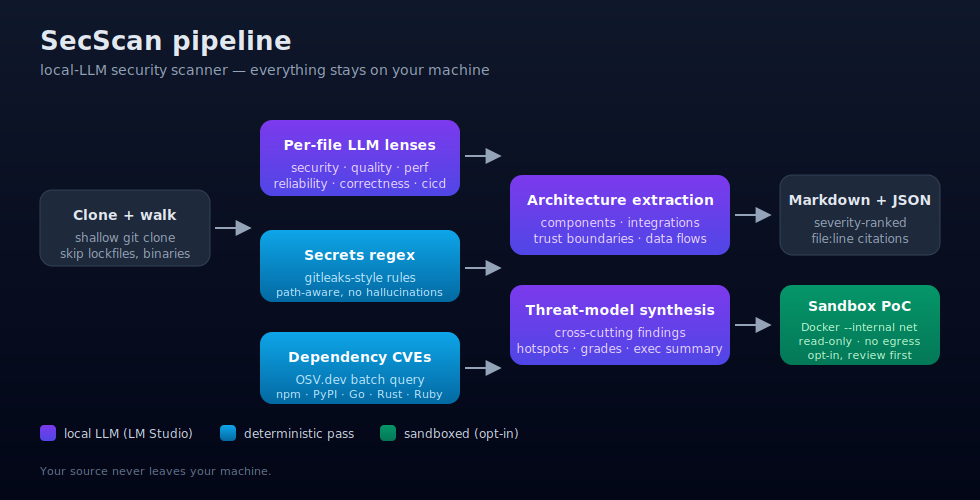

# SecScan

**Local-LLM-powered security scanner for GitHub repositories — runs entirely on your machine.**

Point it at a repo, a GitHub user, or a whole organization. SecScan clones the target, extracts an
**architecture document**, runs a **threat-modeling pass**, scans for **hardcoded secrets**, checks
dependencies against **OSV.dev**, and — if you let it — spins up the target in a **sandboxed Docker
environment** and attempts a proof-of-concept exploit for any confirmed vulnerability, all without
sending a single line of your source code to a third party.

<p align="center">
  
</p>

## What's interesting about it

- **100% local inference.** The LLM runs in [LM Studio](https://lmstudio.ai). Your code never leaves your machine.
- **Multiple lenses.** Not just security — also quality, performance, reliability, correctness, CI/CD. Per-file, line-accurate findings.
- **Architecture-aware threat modeling.** A dedicated pass extracts *what the app is*, *how it's put together*, and *which external integrations it talks to* — then uses that to find **cross-cutting** issues a per-file scan cannot catch (auth bypass paths, SSRF surfaces via integrations, trust boundary violations).
- **Deterministic co-passes.** Regex-based secrets detection (gitleaks-style rules, path-aware) and OSV.dev dependency CVE lookup run alongside the LLM — fast, precise, and don't hallucinate.
- **Sandboxed exploit PoCs.** For a confirmed finding, SecScan can drop the target into a Docker container on an `--internal` network (no outbound), generate a non-destructive PoC, show it to you, and run it against the sandboxed target.
- **Triage mode.** For large orgs or slow local models, `--no-files` skips per-file LLM and runs just architecture + synthesis + secrets + deps — ~15 min/repo instead of hours.

## Install

```bash
git clone https://github.com/YOUR_USERNAME/SecScan
cd SecScan
python3 -m venv .venv && source .venv/bin/activate
pip install -e ".[dev]"
```

Install and start [LM Studio](https://lmstudio.ai):

```bash
# install `lms` CLI from inside LM Studio (Settings → "Install lms")
lms server start
lms ls                        # confirm a model is loaded
```

Optional — copy `.env.example` → `.env` and set `GITHUB_TOKEN` for private repos / better rate limits.

## Quick start

```bash
# sanity check — LMStudio reachable? models loaded? GitHub token OK? Docker up?
secscan doctor

# scan a single repo (prompts you to pick a model if you don't pass --model)
secscan scan owner/repo

# scan every public repo for a user / org, 5 at a time
secscan scan-user some-org --limit 5

# fast triage mode — skip per-file LLM, keep architecture + threat model + CVEs + secrets
secscan scan owner/repo --no-files

# scan a local checkout
secscan scan-local ./path/to/my-project

# attempt a sandboxed PoC for a specific finding
secscan exploit ./.secscan/clones/owner/repo <finding-id> \
    --report ./.secscan/reports/owner__repo.json

# launch the Textual TUI
secscan tui
```

Reports land in `./.secscan/reports/` as Markdown + JSON (one file per repo, plus `SUMMARY.md` if
you ran `scan-user`). Generated PoC scripts are saved to `./.secscan/exploits/` for your review.

## Lenses

Pass `--lens security,quality,performance,...` (or `--lens all`):

| Lens | Looks for |
|---|---|
| `security` | Injection, authn/authz flaws, SSRF, XXE, deserialization, crypto misuse, hardcoded secrets |
| `quality` | Dead code, resource leaks, swallowed exceptions, complexity, API misuse |
| `performance` | N+1 queries, unbounded loops, sync I/O in hot paths, missing pagination |
| `reliability` | Missing timeouts, retry-without-backoff, unbounded queues, silent failures |
| `correctness` | Off-by-one, race conditions, time-zone bugs, contract violations |
| `cicd` | GitHub Actions footguns, Dockerfile anti-patterns, Terraform/K8s misconfigs (scoped automatically) |

## Pipeline

```text
         ┌──────────────┐   ┌───────────────┐   ┌──────────────────┐
         │ clone + walk │──▶│ file filter   │──▶│ per-file lens    │
         └──────────────┘   │ (source only) │   │ (LLM calls)      │
                            └───────────────┘   └──────────────────┘
                                 │                       │
                                 ▼                       ▼
                          ┌─────────────┐      ┌──────────────────┐
                          │ secrets     │      │ architecture     │
                          │ regex       │      │ extraction (LLM) │
                          └─────────────┘      └──────────────────┘
                                 │                       │
                                 ▼                       ▼
                          ┌─────────────┐      ┌──────────────────┐
                          │ deps +      │      │ synthesis /      │
                          │ OSV.dev CVEs│      │ threat model(LLM)│
                          └─────────────┘      └──────────────────┘
                                 │                       │
                                 └───────────┬───────────┘
                                             ▼
                                 ┌──────────────────────────┐
                                 │ Markdown + JSON report    │
                                 └──────────────────────────┘
```

## Exploit sandbox

The `secscan exploit` command is opt-in. It needs a local Docker daemon. For a single finding it:

1. Auto-detects how to run the target (`Dockerfile`, `npm start`, etc.) — override by passing a `SandboxSpec`.
2. Asks the LLM for the **smallest possible, non-destructive** PoC script. If it can't write a safe one it emits `SKIP:`.
3. **Shows the script to you.** No auto-run by default.
4. Starts the target in Docker on an `--internal` network (no outbound internet), `--read-only`, `--cap-drop ALL`, `--security-opt no-new-privileges`, capped CPU/memory/pids.
5. Runs the PoC from a separate **prober container** on the same private network — also capped and read-only.
6. Collects stdout/stderr + target logs, infers success, tears everything down.

## Tests

```bash
pytest -q
```

## Project layout

```text
src/secscan/
├─ cli.py              # Typer entry point
├─ tui.py              # Textual TUI
├─ scanner.py          # orchestrator
├─ lenses.py           # review lenses + prompts
├─ lmstudio_client.py  # OpenAI-compat REST + `lms` CLI + JSON recovery
├─ prompts.py          # shared prompts
├─ architecture.py     # architecture extraction pass
├─ synthesis.py        # threat modeling + cross-cutting findings
├─ repo_context.py     # compact repo summary for whole-repo passes
├─ secrets_scan.py     # regex secret rules (path-aware)
├─ deps.py             # manifest parsing + OSV.dev batch query
├─ filters.py          # include/skip rules + risk-first mode
├─ github.py           # list + shallow clone
├─ models.py           # Pydantic types
├─ report.py           # Markdown report generation
├─ progress.py         # Rich progress (TTY) / plain log (non-TTY)
├─ verify.py           # finding-verification helper (adjudicator pass)
└─ exploit/
   ├─ sandbox.py       # Docker-internal-network runner
   └─ poc.py           # LLM-authored PoC scripts
```

## Safety

- **Only scan code you are authorized to test.** Scanning third-party repos you don't own isn't illegal but publishing the findings without disclosure *is* ethically fraught — follow responsible disclosure.
- The PoC generator is prompted to refuse destructive payloads. The sandbox has no outbound network, a read-only FS, and dropped capabilities. **Review every PoC before running.**
- Private-repo tokens are sent only to `github.com` over HTTPS during clone. Nothing else leaves the machine.

## License

MIT — see `LICENSE`.

## Docs

- [`docs/ARCHITECTURE.md`](docs/ARCHITECTURE.md) — how the pipeline is put together; where state lives; how to extend.
- [`docs/CONFIGURATION.md`](docs/CONFIGURATION.md) — env vars, `.env` format, lens selection, picking a model.
- [`docs/EXAMPLE.md`](docs/EXAMPLE.md) — worked end-to-end walkthrough of scanning a repo.
- [`CONTRIBUTING.md`](CONTRIBUTING.md) — how to contribute.

## Contributing

Issues and PRs welcome. See [`CONTRIBUTING.md`](CONTRIBUTING.md) for principles and good first contributions.

## Credits

Built as a weekend project to answer: *"can a local LLM do a genuinely useful first pass on real code?"* Turns out: yes, if you treat it like an opinionated junior reviewer — fast, helpful, and in need of a careful editor.
